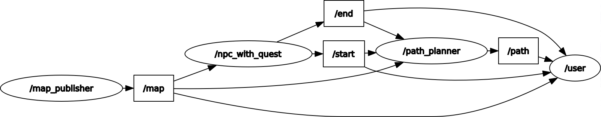

# The task

This section describes the task this repo's code is to solve 

## Task description

Suppose you are developing path planning module of the robot. You will receive a test map files, both yaml and pgm. The goal for this task is to implement and test on the provided map global path planning algorithm, that will take into account obstacles on the map and will be capable of constructing feasible route from point A to point B.

## Rules

1. Deliverable is a ROS/ROS2 package, that is capable of constructing a route from point A to point B, avoiding obstacles from the map.
2. Assume that the robot has circular footprint of diameter 160 mm.
3. You should subscribe to

   * /start - start position of the route, geometry_msgs/PoseStamped
   * /end   - end position of the route, geometry_msgs/PoseStamped
    
   Route should be constructed from last received poses on topics above

4. You should publish found route to
   * /path - found path, nav_msgs/Path.
  
5. The solution must contain C++ or Python code.
6. You are not allowed to use 3rd party packages or simple algorithms like A*, Djisktra for path planning.

# Solution

## Resources

List of assets used to complete the task:  

1. Win10 2004 + Oracle VMBox + Ubuntu 20.04
2. ROS2 Foxy  
   * colcon  
   * rviz  
   * nav_msgs  
   * geometry_msgs  
   * map_server  
3. rqt and rqt_graph
4. VSCode + Python 3.8.5 64-bit  
   * autopep8
   
## Assumptions 

1. the robot has ~~160 mm~~ 200 mm diameter (4 pixel wide)  
>>>Given the map resolution (50mm per pixel), diameter is rounded up from 160 to 200 mm  

   * the pixelized footprint as follows:
   
    ----oo----  
    ---oooo---  
    ---oooo---  
    ----oo----  

2. the robot operates at 100 Hz
>>>two closest stamps in the Path msg may occur only with 0.01 s delimeter
3. the robot is not omnidirectional
>>>In order to navigate correctly, there should be a yaw angle, with (x,y) and the timestamp
4. Robot's state at any given time consist of these parameters:  
   * (x, y)
   * phi, yaw angle
   * width 
## the algorithm 
The ideal version of the RRT i'd like to implement is described with [this scheme](./image.png)

However, RRT implemented in [rapid_exp_tree.py](./src/route_planner/route_planner/rapid_exp_tree.py) is a little bit different as it does not check for an availability of  the path for two points (i.e. is one of them encircled).

### tuning parameters
the RRT implemented here relies on several parameters:
- step size
- max cap of iterations per path generation
- bias rate (how many times

These parameters should be found with optimization methods. However, a fine mix is: 3*robot_footprint, 5000 and 0.1.

setting the max cap very high results in an enormous amount of time one needs to wait to get the solution (or no solutions), but it gives a better chance of finding one for two points on the opposite sides of the map.

setting the bias rate very high results in the algorithm getting stuck in local point near the occupied region

setting the step size very high results in "chess knight problem", when in order to get from one adjacent point to an another, robot need to take a detour.

# How to use 
First, build and install with `colcon build` and `source ./ws2_ros/install/setup.bash`

>Terminal 1: 
```
$ ros2 run route_planner map_publisher
```
>Terminal 2: 
```
$ ros2 run route_planner npc_with_quest
```
>Terminal 3: 
```
$ ros2 run route_planner path_planner
```
>Terminal 4: 
```
$ ros2 run route_planner user
```
After that, calling the RQT graph should look like this 


some solutions (paths found) are available [here](./src/route_planner/test_map)

# TODOs
1. make messages in topics /start /end /path in line with each other, i.e. add a disambiguation that clarifies that particular /path message belongs to particular /start and /end
2. in /path message, add sampling time for each pose, so the valocity of the robot would be clear. now, /path_msg.poses\[i\].stamp is empty. however, there should be stamps starting from 0 for poses\[0\] to an end time of the trip for poses\[end\]. all stamps should respect the discretization time of the robot. 


### some valid points :
(-8.2, -5.85)
(-0.3, 0.6)
(-6.4, -7.65)
(-0.9, -7.6)
(-1.1, -5.75)
(-7.3, -7.7)
(-4.3, -2.4)
(-7.4, -6.8)
(-0.6, -0.8)
(-0.85, -0.15)
(-5.75, -3.95)
(-9.05, -7.6)
(-8.9, -4.55)
(-4.35, -3.6)
(-9.1, -4.05)
(-4.2, -1.65)
(-3.65, -1.1)
(-1.4, -0.75)
(-4.55, -5.4)
(-7.45, -8.55)
(-7.25, -8.05)
(-3.75, -5.0)
(-0.15, -0.7)
(-3.3, -1.75)
(-3.3, 0.05)
(-7.05, -4.15)
(-7.85, -8.2)
(-5.85, -8.45)
(-3.15, -1.6)
(-1.35, -2.7)
